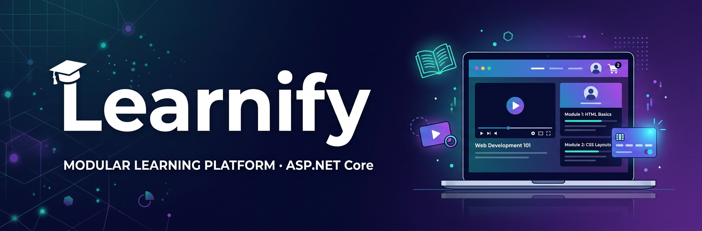
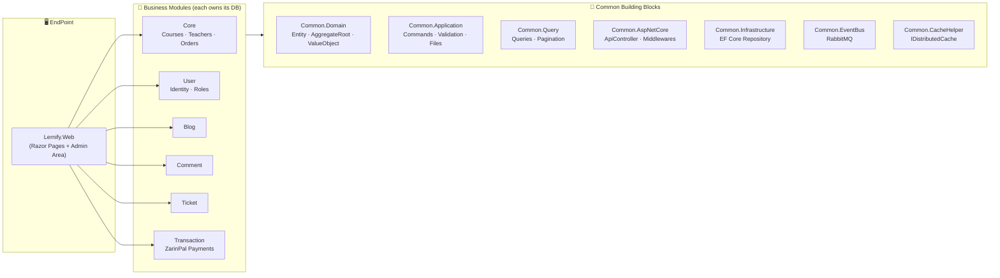

<div align="center">



# 🎓 Learnify

**A modular online learning platform (LMS) built with ASP.NET Core, Clean Architecture, CQRS & Domain-Driven Design**

[](https://dotnet.microsoft.com)
[](https://learn.microsoft.com/dotnet/csharp/)
[](https://learn.microsoft.com/aspnet/core/)
[](#-architecture)
[](#-architecture)
[](https://learn.microsoft.com/ef/)
[](#-database-layout)
[](https://rabbitmq.com)
[](#-license)

[Features](#-features) · [Architecture](#-architecture) · [Modules](#-modules) · [Getting Started](#-getting-started) · [Author](#-author)

</div>

---

## 📖 About

**Learnify** is a full-featured **online course marketplace & learning management system (LMS)** — think of a small, self-hosted *Udemy*. Students browse course categories, watch video episodes, buy courses through a payment gateway, read articles, comment and open support tickets, while teachers publish their own courses and admins manage the whole platform from a built-in admin panel.

The solution is implemented as a **Modular Monolith** on **.NET 10**, following **Clean Architecture**, **CQRS (with MediatR)** and **Domain-Driven Design** building blocks. Every business module owns its **own SQL Server database** and communicates with the others through **RabbitMQ integration events** — giving you the isolation of microservices with the simplicity of a single deployable app, and a clear path to split into services later.

> 🌐 **Note:** the user interface is implemented in **Persian (Farsi, RTL)**. The codebase, identifiers and this documentation are in English.

---

## ✨ Features

### 🛒 Course Marketplace
- Hierarchical **course categories** (category → sub-category)
- Courses with **sections → video episodes**, trailers, price, level (`Beginner` / `Advanced` / `Professional`), status (`StartSoon` / `InProgress` / `Completed`) and **SEO metadata**
- **Free preview episodes** (`IsFree`) and token-protected video URLs with attachments per episode
- Video playback powered by **Video.js**

### 👨‍🏫 Teachers
- Teacher **registration with CV upload** and admin approval workflow (`Pending → Active/Rejected`)
- Teacher panel for creating and managing courses, sections and episodes

### 💳 Payments & Orders
- Shopping **cart / orders** with order items, discount support and domain events
- **ZarinPal payment gateway** integration (request, verify, refund — with sandbox configuration)
- Dedicated **Transaction** module that records every payment attempt (success / error / cancelled) with card PAN, ref-id and authority

### 👥 Users & Access Control
- **JWT authentication** (token delivered via cookie and re-attached to the `Authorization` header)
- Role-based access with **roles, permissions** and a claim-based authorization infrastructure
- User **profile** (edit, avatar, change password) and **in-app notifications**

### 📰 Content & Community
- **Blog** module: posts with categories, slugs, visit counters and images
- **Comment** module: threaded comments (replies) on courses *and* articles, with admin moderation, submitted via AJAX
- **Ticket** module: support tickets with a message thread between user and support

### 🛠 Admin Panel
- Full Razor Pages **Admin area** for Courses, Teachers, Users, Roles, Blog, Comments and Tickets
- **CKEditor 4/5** rich-text editors, custom TagHelpers (modals, delete-confirmations, active-tab) and a reusable exception-handling middleware

---

## 🏗 Architecture

Learnify follows a **Modular Monolith + Clean Architecture + CQRS** style:



Key architectural decisions:

| Decision | How it's done |
| --- | --- |
| **Modularity** | Each module is a set of projects with its own `Bootstrapper` extension method (`InitCoreModule()`, `InitUserModule()` …) wired in `Program.cs` |
| **CQRS** | Commands/handlers via **MediatR**; the read side uses separate **Query projects with Dapper + EF Core** |
| **DDD** | Rich domain models with private setters, guard clauses, domain services (`ICourseService`, `ITeacherService`…), domain events (`OrderFinallyEvent`) and value objects (`SeoData`, `PhoneNumber`) |
| **Database-per-module** | 6 isolated SQL Server databases — no cross-module table joins |
| **Integration events** | **RabbitMQ** event bus (`UserRegistered`, `UserEdited`, `NewNotificationIntegrationEvent`) for cross-module communication |
| **Validation** | **FluentValidation** with a MediatR pipeline `CommandValidationBehavior` + custom file validation attributes |
| **Result pattern** | Shared `OperationResult` and unified `ApiResult` HTTP responses with a global exception middleware |

---

## 📁 Solution Structure

The solution file is the new XML-based **`Learnify.slnx`** (20 projects):

```text
Learnify/
├── Learnify.slnx                    # Solution (new XML format)
│
└── src/
    ├── Common/                      # 🧱 Shared building blocks (no business logic)
    │   ├── Common.Domain            #   Entity, AggregateRoot, ValueObject, exceptions, utilities
    │   ├── Common.Application       #   IBaseCommand/Handler, FluentValidation, file & image utils,
    │   │                            #   local/FTP storage services, email templates, security utils
    │   ├── Common.Query             #   IQuery/IQueryHandler, BaseFilter, pagination contracts
    │   ├── Common.Infrastructure    #   EF Core BaseRepository + Dapper helpers
    │   ├── Common.AspNetCore        #   ApiController, ApiResult, exception middleware, JWT claims
    │   ├── Common.EventBus          #   RabbitMQ event-bus abstractions + integration events
    │   └── Common.CacheHelper       #   IDistributedCache extensions (Redis-ready)
    │
    ├── Modules/                     # 🧩 Business modules (each owns its DbContext + database)
    │   ├── Core/                    #   ⭐ The heart of the LMS
    │   │   ├── CoreModule.Domain        # Courses, Sections, Episodes, Teachers, Orders, Categories
    │   │   ├── CoreModule.Application   # CQRS commands (create/edit courses, teacher requests, orders)
    │   │   ├── CoreModule.Infrastructure# EF Core context, repositories, event handlers
    │   │   ├── CoreModule.Query         # Dapper/EF read side (course lists, search, teacher queries)
    │   │   ├── CoreModule.Facade        # Cross-module facades (course, teacher, order services)
    │   │   └── CoreModule.Config        # Module DI wiring / bootstrapper
    │   ├── User/
    │   │   ├── UserModule.Core         # CQRS commands/queries: register, edit, password, notifications
    │   │   └── User.Module.Data        # User, Role, UserRole, Permission, UserNotification entities
    │   ├── Blog/
    │   │   └── Blog.Module             # Posts, categories, slugs, visits
    │   ├── Comment/
    │   │   └── CommentModule           # Threaded comments for courses & articles + moderation
    │   ├── Ticket/
    │   │   ├── TicketModule            # Support tickets & message threads
    │   │   └── TransactionModule       # ZarinPal gateway service + payment transactions
    │   └── (see Modules section below)
    │
    └── EndPoint/
        └── Lernify.Web/             # 🖥 The web application (ASP.NET Core, net10.0)
            ├── Pages/                   # Public site: Home, Courses, Course, Cart, Blog, Auth
            ├── Pages/Profile/           # User panel: profile, notifications, my courses, tickets,
            │                            #   teacher registration & teacher course management
            ├── Areas/Admin/             # Admin panel: Courses, Teachers, Users, Roles, Blog,
            │                            #   Comments, Tickets
            ├── Controllers/             # AJAX, Comment and Transaction API controllers
            ├── Infrastructure/          # JWT setup, custom validations, Razor & service utilities
            ├── TagHelpers/              # CancelButton, DeleteItem, OpenModal, Question, SetActive…
            └── wwwroot/                 # Static assets (Bootstrap, CKEditor, Video.js, OwlCarousel…)
```

---

## 🧩 Modules

### ⭐ Core Module — courses, teachers & orders
The main LMS engine, internally layered Domain → Application → Infrastructure → Query → Facade:

- **Domain**: `Course` (with `Section` → `Episode`), `CourseCategory`, `Teacher`, `Order`/`OrderItem`, `CourseStudent` — all rich aggregates with guard clauses and domain services
- **Application**: MediatR commands — create/edit course, add sections & episodes, register/accept/reject teachers, add/remove order items, finalize order (`OrderFinallyEvent`)
- **Query**: optimized read models for course browsing, search & filters, teacher pages and orders
- **Facade**: the contract other modules use to reach Core without referencing its internals

### 👤 User Module — identity & access
Users, roles & permissions with JWT auth. Publishing a `UserRegistered` integration event lets the rest of the system react to signups without coupling modules. Includes user notifications and full profile management.

### 📰 Blog Module
A complete publishing module — posts, categories, slugs, visit counters, cover images and SEO data, managed from the admin area.

### 💬 Comment Module
Threaded (nested) comments shared by **courses and articles** (`CommentType`), exposed to the UI via an AJAX controller and moderated from the admin area.

### 🎫 Ticket Module
Support-ticket system with message threads, statuses and an admin-side inbox.

### 💳 Transaction Module
Payment infrastructure built around the **ZarinPal** gateway (request → redirect → verify → refund), recording every payment attempt with its status (`PaymentSuccess` / `PaymentError` / `CancelPayment`), card PAN, `RefId` and `Authority`.

---

## 🛠 Tech Stack

| Layer | Technology |
| --- | --- |
| **Language / Runtime** | C# 13 / **.NET 10** |
| **Web framework** | ASP.NET Core — Razor Pages, MVC areas, custom TagHelpers |
| **Architecture** | Modular Monolith, Clean Architecture, CQRS, DDD |
| **Mediation** | [MediatR](https://github.com/jbogard/MediatR) 14 |
| **Validation** | [FluentValidation](https://fluentvalidation.net) 12 |
| **ORM (write side)** | [Entity Framework Core](https://learn.microsoft.com/ef/) 10 |
| **ORM (read side)** | [Dapper](https://github.com/DapperLib/Dapper) 2 |
| **Database** | Microsoft SQL Server (6 databases, database-per-module) |
| **Message broker** | [RabbitMQ](https://rabbitmq.com) (integration events / event bus) |
| **Authentication** | JWT Bearer (cookie-bridged) |
| **Caching** | `IDistributedCache` (Redis-ready helper) |
| **Payment** | ZarinPal gateway (v4 API + sandbox) |
| **Rich text / media** | CKEditor 4 & 5, Video.js player |
| **Front-end assets** | Bootstrap, jQuery, OwlCarousel, Particles.js |

---

## 🚀 Getting Started

### Prerequisites

- [.NET 10 SDK](https://dotnet.microsoft.com/download/dotnet/10.0)
- **SQL Server** (LocalDB, Docker or a full instance)
- **RabbitMQ** (e.g. `docker run -d -p 5672:5672 rabbitmq:3`) — used for cross-module integration events
- (Optional) [EF Core CLI tools](https://learn.microsoft.com/ef/core/cli/dotnet): `dotnet tool install --global dotnet-ef`

### 1. Clone the repository

```bash
git clone https://github.com/MohammadHasanp/Learnify.git
cd Learnify
```

### 2. Configure the application

Edit `src/EndPoint/Lernify.Web/appsettings.json`:

- `ConnectionStrings` — 6 connection strings (User, Ticket, Core, Blog, Comment, Transaction). Point them at your SQL Server instance.
- `JwtConfig` — **replace the sign-in key** with your own secret for anything beyond local testing.
- `RabbitMQ` — your broker host & credentials.
- `ZarinPal` — your merchant ID, payment/verify/refund URLs (a `ZarinPal-sandBox` section is included for testing).

### 3. Create the databases

Apply EF Core migrations for every module context (`--startup-project` is the web app):

```bash
cd src/EndPoint/Lernify.Web

dotnet ef database update --context UserContext        --project ../../Modules/User/User.Module.Data
dotnet ef database update --context CoreModuleEfContext --project ../../Modules/Core/CoreModule.Infrastructure
dotnet ef database update --context BlogContext         --project ../../Modules/Blog/Blog.Module
dotnet ef database update --context CommentContext      --project ../../Modules/Comment/CommentModule
dotnet ef database update --context TicketContext       --project ../../Modules/Ticket/TicketModule
dotnet ef database update --context TransactionContext  --project ../../Modules/Ticket/TransactionModule
```

### 4. Run

```bash
dotnet run --project src/EndPoint/Lernify.Web
```

Then browse to the URL shown in the console (e.g. `https://localhost:7xxx`) — the home page, course catalog and auth pages are the best places to start exploring.

---

## 🗄 Database Layout

Each module owns an isolated database — modules never share tables:

| Database | Module | Contents |
| --- | --- | --- |
| `Lernify_UserDb` | User | Users, roles, permissions, notifications |
| `Lernify_Core` | Core | Courses, sections, episodes, teachers, orders, students |
| `Lernify_Blog` | Blog | Posts, categories |
| `Lernify_Comment` | Comment | Comments & replies |
| `Lernify_Ticket` | Ticket | Tickets & messages |
| `Lernify_Transaction` | Transaction | Payment transactions |

Cross-module reads go through **facades & integration events**, not joins.

---

## 🤝 Contributing

Issues and pull requests are welcome! If you want to contribute:

1. Fork the repository
2. Create your feature branch (`git checkout -b feature/amazing-feature`)
3. Commit your changes (`git commit -m 'Add some amazing feature'`)
4. Push to the branch (`git push origin feature/amazing-feature`)
5. Open a Pull Request


---

## 👤 Author

**Mohammad Hasan Pirayandeh** — *Backend .NET Developer*

- 🐙 GitHub: [@MohammadHasanp](https://github.com/MohammadHasanp)
- 📧 Email: [pirayandehmohammadhasan@gmail.com](mailto:pirayandehmohammadhasan@gmail.com)

---

<div align="center">

**⭐ If you like this project, give it a star — it helps a lot! ⭐**

</div>
